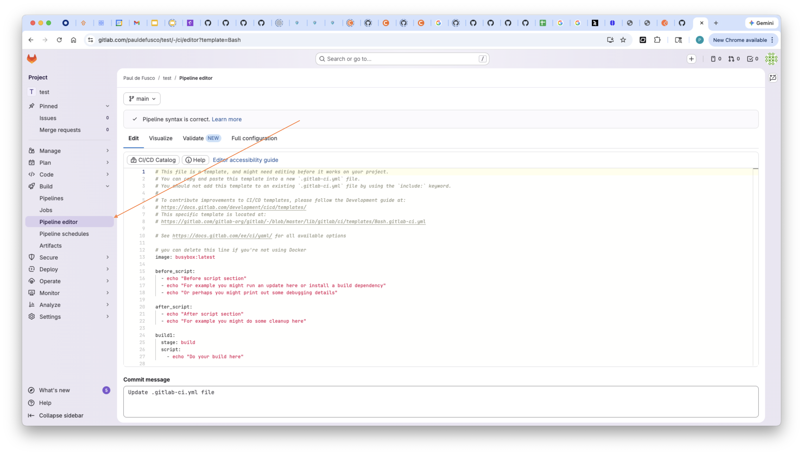

# Multi Cloud/Hybrid Cloud CI/CD Pipelines with CDE, Spark and GitLab


## Summary

This tutorial demonstrates how you can use GitLab in conjunction with the Cloudera Data Engineering Service to meet Multi-cloud and Hybrid-cloud use cases.


## Prerequisites

To complete the tutorial, you will need the following:

* A CDE Virtual Cluster in Public Cloud (AWS)
* A GitLab CI account
* Some familiarity with PySpark and Shell Scripting, although no code changes are required


## Execute and Monitor a Spark Job via the CDE API in GitLab CI

### Step 1: Creating a GitLab project

Once you have signed up to a GitLab Account, log into through the main page.

Select “Menu” -> “Projects” -> “Create New Project”

In the project creation wizard, enter your project name and select “No Deployment Planned” under the “Project Deployment Target” dropdown. 



We will primarily work with GitLab CI, which you can find under the “CI/CD” tab on the left pane. GitLab CI allows you to declare GitLab jobs and pipelines through a file named “.gitlab-ci.yml”.

To create the file, click on “CI/CD”, then “Editor” and finally “Configure Pipeline” as shown below.


GitLab automatically populates the file with some sample GitLab CI Jobs for you. Notice the “stages” declaration at line 16. Each stage represents a phase in your pipeline. Each entry below represents a GitLab CI Job with its name being declared in its first line. The set of all stages, or essentially all jobs in a “.gitlab-ci.yml” file, make up a GitLab CI pipeline.

The “script” section in each GitLab CI Job is where you can run your commands. These could be simple bash commands or more. In the next sections of this tutorial, we will issue CDE API commands against CDE Virtual Clusters by executing “curl” commands in the script section of each job. There are many more ways to work with GitLab CI Pipelines, including using a Docker container, Python, and a lot more. These are beyond the scope of this demo.

Additionally, notice the “Commit Changes” button at the bottom of the screen. We will edit the “.gitlab-ci.yml” file through the editor and commit different versions as we make modifications to our pipeline. GitLab will log each version for us, and immediately run the pipeline at each commit.


Before getting into our tutorial, let’s try running the given example. Customize the Commit Message and Click on the “Commit Changes” button.

Notice GitLab CI will automatically validate the pipeline for us. This includes a syntax check for the bash commands in each GitLab CI Job “script”.

Wait for the pipeline to run, then click on “View Pipeline” at the top right of the screen.  


In the next screen, you can drill down into each GitLab CI Job. Click on “build-job” as shown below.


Finally, examine the output. Notice the bash commands were executed (‘echo “Compiling the code…”’ and ‘echo “Compile complete”’). These were the bash commands in each “script” section under the job “build-job”. To be clear nothing actually compiled, we just executed two bash commands.   


### Step 2: Creating GitLab environment variables for CDE API use

Now that you have a basic understanding of GitLab CI Jobs and Pipelines, you can move on to using this tool to interact with the CDE Service.

Before you can go ahead and update our GitLab CI Pipeline you need to set environment variables. Environment variables allow you to store and reuse values such as URLs, Credentials, etc. as part of your GitLab CI Jobs.

Navigate to the CDP Home Page and open the CDE Service.


On the left, make sure you select the CDE Service your CDE Virtual Cluster is associated with. Then, click on “Cluster Details” on your cluster.  


Copy the “JOBS API URL” to your clipboard as shown below. For now paste that in your editor. You will use this later as variable 1.  


Next, derive “CDE_SVC_URL” by modifying the “JOBS_API_URL” value as shown below. For now paste that in your editor. You will use this as variable 2.

```
Sample JOBS API URL:
https://abc6abc2.cde-wxwx1hjk.go02-dem.ylcu-atmi.cloudera.site/dex/api/v1

Replace “abc6abc2” with “service” and every character to the right of “.site”

Sample CDE SVC URL:
https://service.cde-wxwx1hjk.go02-dem.ylcu-atmi.cloudera.site
```

Finally, derive “CDE_CREDENTIALS” by creating a key value pair with your CDP Workload User and Password as shown below. For now paste that in your editor. You will use this as variable 3 below.

```
cdp_workload_user:cdp_workload_password
```

If you’re not sure what your CDP Workload User and Password are, please contact your administrator or set these in the User Management Section of the CDP Management Console.

Navigate back to your GitLab CI Project. Then access the Variables Section by clicking on “Settings” and “CI/CD” as shown below.


Expand the variables section and click on “Add Variable”.


Next, we will add three variables with the following values. When you’re done with each, click on “Add Variable” and then proceed to the next.


```
Variable 1
Key: “CDE_JOB_URL”
Value: paste the URL you copied from the CDE Virtual Cluster “JOBS API URL” tab.

Variable 2
Key: “CDE_SVC_URL”
Value: paste the URL you created earlier for the CDE_SVC_URL variable.

Variable 3
Key: “CDE_CREDENTIALS”
Value: paste the username:password key value pair you created earlier for CDE_CREDENTIALS
```

Your Variables Section should look something like this when you’re done.


You are now ready to finally create a GitLab CI Pipeline leveraging the CDE API.


### Step 3: Creating GitLab environment variables for CDE API use

##### Committing and launching your first pipeline

Navigate back to the Editor under the CI/CD tab on the left pane. Replace the contents of your “.gitlab-ci.yml” file with the script below:

```
stages:          # List of stages for jobs, and their order of execution
 - deploy

create_cde_resource:
 stage: deploy
 image: docker:stable
 before_script:
   - apk add --update curl && rm -rf /var/cache/apk/*
   - apk add jq
 script:
   - 'CDE_TOKEN=$(curl -u "${CDE_CREDENTIALS}" "${CDE_SVC_URL}/gateway/authtkn/knoxtoken/api/v1/token" | jq -r ".access_token")'
   - 'curl -H "Authorization: Bearer ${CDE_TOKEN}" -X POST "${CDE_JOB_URL}/resources" -H "Content-Type: application/json" -d "{ \"name\": \"gitlab2cde_resource_test\"}"'
```

Let’s walk through the above in more detail.

* We only need one stage. We modified the stages section leaving only a “deploy” stage.
* At line 6, we declared a docker image. This is provided by GitLab CI and does not need modification, but if you wanted to you could use a custom image.
* At lines 7, 8, and 9 we use apk (Alpine Linux package manager) to download the required packages to send the request to the CDE Virtual Cluster
* At line 11, we set the CDE Token leveraging the “CDE_CREDENTIALS” and “CDE_SVC_URL” environment variables. The token is necessary to authenticate the API request with the CDE Virtual Cluster.  
* At line 12 we send the request to the CDE Virtual Cluster.

Now you are ready to submit this pipeline. Enter a brief comment in the “Commit Message” section and then click on the “Commit Changes” button.

After a brief moment, the pipeline should have succeeded. As you did previously with the example file, click on “View Pipeline” at the top right. Then open the job and observe the output. In green, notice each bash command executed successfully.


Finally, confirm the CDE Resource has been successfully created. Navigate back to the CDE Service and click on the “View Jobs” icon to access the Virtual Cluster’s workloads.


On the left pane, click on “Resources” and validate that “gitlab2cde_resource_test” has been created.


##### Creating and Executing and End to End Pipeline

Now that we have covered the basics, we will build a basic pipeline. Before we can proceed, we need to upload our Spark Job to the GitLab Project folder.

Create a new folder in the main project folder as shown below.


Name it “cde_jobs”.


Now upload the “SimpleSparkJob.py” file located in the main folder of this tutorial.


Ensure you edit the commit message so you can come back to it later if you need to.


Familiarize yourself with the PySpark code. Notice this is a simple job. It does not require any edits.


Now navigate back to the “Editor” from the “CI/CD” tab. Replace the contents of “.gitlab-ci.yml” with the following script:

```
stages:          # List of stages for jobs, and their order of execution
 - deploy

create_cde_job:
 stage: deploy
 image: docker:stable
 before_script:
   - apk add --update curl && rm -rf /var/cache/apk/*
   - apk add jq
 script:
   - 'CDE_TOKEN=$(curl -u "${CDE_CREDENTIALS}" "${CDE_SVC_URL}/gateway/authtkn/knoxtoken/api/v1/token" | jq -r ".access_token")'
   - 'curl -H "Authorization: Bearer ${CDE_TOKEN}" -X POST "${CDE_JOB_URL}/resources" -H "Content-Type: application/json" -d "{ \"name\": \"gitlab2cde_resource\"}"'
   - 'curl -H "Authorization: Bearer ${CDE_TOKEN}" -X PUT "${CDE_JOB_URL}/resources/gitlab2cde_resource/SimpleSparkJob.py" -F "file=@cde_jobs/SimpleSparkJob.py"'
   - 'curl -H "Authorization: Bearer ${CDE_TOKEN}" -X GET "${CDE_JOB_URL}/resources/gitlab2cde_resource" | jq .'
   - 'curl -H "Authorization: Bearer ${CDE_TOKEN}" -X POST "${CDE_JOB_URL}/jobs"
         -H "accept: application/json"
         -H "Content-Type: application/json"
         -d "{ \"name\": \"gitlab2cde_job\", \"type\": \"spark\",
     \"retentionPolicy\": \"keep_indefinitely\",
     \"mounts\": [ { \"dirPrefix\": \"/\", \"resourceName\": \"gitlab2cde_resource\" } ],
     \"spark\": { \"file\": \"SimpleSparkJob.py\", \"conf\": { \"spark.pyspark.python\": \"python3\" } },
     \"schedule\": { \"enabled\": false} }"'

run_cde_job:
 stage: deploy
 image: docker:stable
 before_script:
   - apk add --update curl && rm -rf /var/cache/apk/*
   - apk add jq
 script:
   - 'CDE_TOKEN=$(curl -u "${CDE_CREDENTIALS}" "${CDE_SVC_URL}/gateway/authtkn/knoxtoken/api/v1/token" | jq -r ".access_token")'
   - 'curl -H "Authorization: Bearer ${CDE_TOKEN}" -X POST "${CDE_JOB_URL}/jobs/gitlab2cde_job/run"'
   - 'curl -H "Authorization: Bearer ${CDE_TOKEN}" -X GET "${CDE_JOB_URL}/job-runs?filter=job%5Beq%gitlab2cde_job&limit=20&offset=0&orderby=ID&orderasc=true" | jq .'

monitor_cde_job:
 stage: deploy
 image: docker:stable
 before_script:
   - apk add --update curl && rm -rf /var/cache/apk/*
   - apk add jq
 script:
   - 'CDE_TOKEN=$(curl -u "${CDE_CREDENTIALS}" "${CDE_SVC_URL}/gateway/authtkn/knoxtoken/api/v1/token" | jq -r ".access_token")'
   - 'JOB_ID=$(curl -H "Authorization: Bearer ${CDE_TOKEN}" -X GET "${CDE_JOB_URL}/job-runs?filter=job%5Beq%5Dgitlab2cde_job&limit=20&offset=0&orderby=ID&orderasc=false" | jq ".runs[0].id")'
   - 'curl -H "Authorization: Bearer ${CDE_TOKEN}" -X GET "${CDE_JOB_URL}/job-runs/${JOB_ID}/logs?type=driver%2Fstdout"'
   - 'mkdir cde_logs'
   - 'curl -H "Authorization: Bearer ${CDE_TOKEN}" -X GET "${CDE_JOB_URL}/job-runs/${JOB_ID}/logs?type=driver%2Fstdout" > cde_logs/logs.txt'
 artifacts:
   paths:
     - "cde_logs/logs.txt"
```

In summary, the new script is doing the following:

* We have three jobs: “create_cde_job”, “run_cde_job”, “monitor_cde_job”
* In “create_cde_job” we create a CDE Resource, upload the SimpleSparkJob.py script from the cde_jobs folder in the GitLab project, and instantiate a manual CDE Job of type Spark.
* In “run_cde_job” we run the CDE Job and send a request to list runs
* In “monitor_cde_job” we parse the output Json from the same request and load the CDE Job logs into a GitLab CI Artifact.  

For now, commit the changes and let the three GitLab CI Jobs run. Explore each GitLab CI Job output and familiarize yourself with the workflow.

Navigate to the CDE Virtual Cluster’s Jobs page and validate the new CDE Resource and Job execution.


Notice the CDE Job might still be running. When it completes, click on the latest Run ID and use the CDE UI to explore the logs.


Now navigate back to the GitLab CI, open “Jobs” under “CI/CD”, then open “monitor_cde_job”.   


Notice the same error trace you saw in the CDE Job logs. On the right side, click on the “Browse” icon of the “Artifacts” section.


Notice a folder has been created. Open it and GitLab will download the logs for you.


Open the file on your local desktop and notice that once again its contents are the same as the logs you found in CDE and the GitLab CI Job output.

An Artifact allows you to temporarily store and reuse files created as part of GitLab CI Job execution. It will become more important in the next sections.

Before moving on to the next section, notice we tested the above CDE API commands with its documentation. Familiarize yourself with it and notice you can build more sophisticated pipelines with its rich methods.  

To access the documentation, navigate back to the CDE Virtual Cluster Details page.


Then click on the “API DOC” link


You can build API commands for your cluster from there. For example, click on the “GET/job-runs” method under the “job-runs” section.


Then click on “Try it out”


And try entering a few options in the provided fields. For example, enter the “job[eq]gitlab2cde_job” string in the first field.


Then scroll down and click on the “execute” blue button


Observe the CURL command being built for you and notice specifically the latter part of the URL. This is exactly how we built one of our commands in the GitLab CI editor. Can you remember which one?

Finally, also notice that the response is populated for you. This is a great way to test your requests and learn the API at the same time.


## Conclusions

This tutorial demonstrated how to execute Spark pipelines across different CDE Virtual Clusters. This also opens up possibilities for complex workflows

* You can deploy resilient pipelines within Virtual Clusters that closely reflect the needs of each. Each Virtual Cluster may sit in a different Cloud. AWS, Azure, and even Private Cloud with OCP and Cloudera ECS.
* You can isolate and secure datasets in different datalakes while managing and monitoring a unified pipelines with unified tooling i.e. the CDP Control Plane, Workload Manager, and of course GitLab CI
* You can now create workflows encompassing different Spark versions, for example to test Spark upgrades across multiple Spark versions
* You can move your workloads to better purpose driven CDE Virtual Clusters, for example dedicating one for data profiling and testing with Great Expectations, or Machine Learning with Spark ML, or even Spark Job tuning and more.
